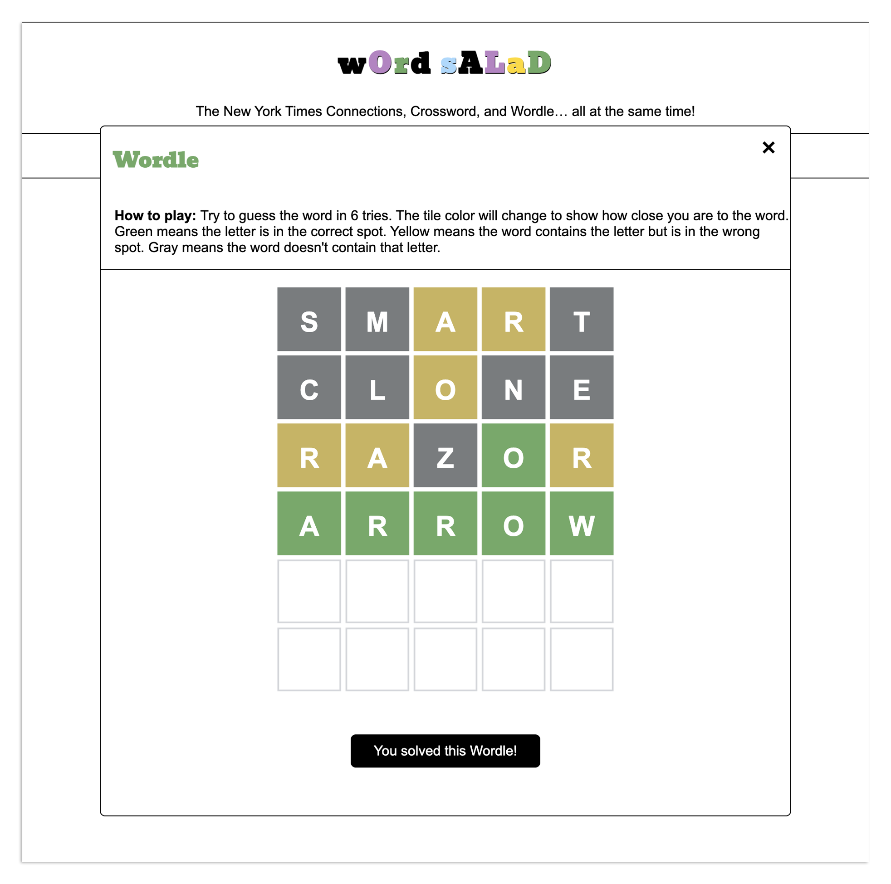

# What is Word Salad?

**Word Salad** is a game for fans of **_The New York Times_ Crossword, Connections, and Wordle**, who have been clamoring to play all three games... simultaneously.

Built with reusable React components, **Word Salad** features a responsive interface that easily transitions between different puzzles within the same session, providing real-time feedback and scoring. The application is fully responsive and designed to be intuitive and easy to play.

Early, completely unsubstantiated data shows that **Word Salad** is 300% more fun than the originals.

## Getting Started

First, run the development server:

```bash
npm run dev
# or
yarn dev
# or
pnpm dev
# or
bun dev
```
Open [http://localhost:3000](http://localhost:3000) with your browser to play.

## Built with

* React
* Next.js
* TypeScript
* HTML
* CSS

## How to Play

**1. The board contains 16 cards. Some of the cards already have words. Some of the cards contain a puzzle that you'll need to solve to reveal the word.**


**2. Click on the card to open the puzzle. The puzzle will be either a Wordle or a crossword. Solve the puzzle to reveal the word.**


**3. Once all the words have been revealed, you'll be able to play Connections.**


**4. Select a set of 4 cards that have something in common. If you select the correct group of cards, the category will be revealed.**


**5. Continue selecting groups of 4 cards until you've found all the categories.**


**6. At the end of the game, you'll see a summary of your results for each puzzle type and your final score.**


## Features

### Overall
* Seamlessly transition between different puzzle modes:
  * Connections
  * Wordle
  * Crossword
* Real-time feedback to user input
  * After you successfully solve a puzzle, the word will appear on the card in black text.
  * If you are unable to solve the puzzle or you quit the puzzle without solving it, the word will appear on the card in red text.
* Results summary at the end of the game:
  * Shows the number of Wordles and Crosswords solved and the number of Connections categories found
  * Calculates overall score

### Wordle
* Real-time feedback to user input
  * When you submit a word, tile colors change to show how close the guess is to the correct word. The game logic takes into account letter position duplicate letters.
  * You can only input valid letter characters.
  * You can't submit duplicate guesses.
  * Different animations play based on user interactions.
* State management - The game keeps track of previous guesses.
* Binary search to efficiently confirm that the submitted word is in the 14,800+ word Wordle dictionary.



---

### Crossword
* Real-time feedback to user input
  * You can only input valid letter characters.
  * You can't submit duplicate guesses.
  * Different animations play based on user interactions.
  * The submit button is enabled/disabled according to user actions.
* State management - The game keeps track of previous words guessed and the number of guesses made.


---

### Connections
**Solving puzzles**
* Real-time feedback to user input
  * Deselect and Submit buttons are enabled/disabled according to user actions.
  * You can't select more than 4 cards at a time.
  * You can't submit duplicate guesses.
  * The game will tell you when you are 1 card away from solving a category.
  * Different animations play based on user interactions.
* State management - The game keeps track of the sets of cards you have selected previously and the number of guesses made.
* Shuffle cards or deselect all previously selected cards.


---
## Potential Roadmap

- [ ] Wordle features
  - [ ] Hard mode - All successive guesses must contain previously guessed letters that were matches
- [ ] Crossword features
  - [ ] After each guess, show the letters that are correct
  - [ ] Give an option for Crossword hints
- [ ] After the connections game has been played, the board flips over and turns into different puzzles:
  - [ ] Sudoku
  - [ ] Spelling Bee
  - [ ] Strands
- [ ] Option to create custom games

## Answer Key

```
CORE: [HEART (wordle), CRUX (crossword clue: "Gist"), ESSENCE, SUBSTANCE]

COMPLICATED: [MESSY (wordle), BAROQUE (crossword clue: "Music style popularized by Bach"), COMPLEX, ELABORATE]

SYMBOLS USED IN MAKING LISTS: [ARROW (wordle), BULLET (crossword clue: "Muggsy Bogues or Manute Bol, once), CHECKBOX, HYPHEN]

WHAT 'CROSS' MIGHT MEAN: [ANGRY (wordle), CRUCIFIX (crossword clue: "One of those 'T' necklaces, maybe"), BETRAY, HYBRID]
```
```
LATIN WORDS: [CARPE (wordle), QUID (crossword clue: "A pound across the pond, perhaps"), ERGO, VOX]

PACK (AWAY) FOR FUTURE USE: [STORE (wordle), SQUIRREL (crossword clue: "________ Nut Zippers"), STASH, STOW]

________ GAME: [SQUID (wordle), ARCADE (crossword clue: "where you might find Ms. Pac-Man"), BLAME, NUMBERS]

ADJECTIVES FOR ASSETS: [TOXIC (wordle), FROZEN (crossword clue: "Ice cold"), FIXED, LIQUID]
```
```
HIGHLY SKILLED: [ADEPT (wordle), ACE (crossword clue: "Part of a winning pair in blackjack"), MAESTRO, HOTSHOT]

KINDS OF CAKE: [POUND (wordle), CRUMB (crossword clue: "The soft part of bread"), MARBLE, BIRTHDAY]

TANGIBLE: [SOLID (wordle), MATERIAL (crossword clue: "Half of a moniker for Madonna"), CONCRETE, REAL]

THINGS YOU CAN THROW IN METAPHORS: [PARTY (wordle), WRENCH (crossword clue: "To pull or twist"), CURVEBALL, TANTRUM]
```

```
GET EXCITED, WITH "UP": [PSYCH (wordle), FIRE (crossword clue: "Earth Wind and ____"), HYPE, AMP]

KINDS OF SHOES: [SLIDE (wordle), FLAT (crossword clue: "A tire might get this"), PUMP, MULE]

LEGISLATIVE ROLES: [CHAIR (wordle), WHIP (crossword clue: "Part of a lion tamer's costume"), SPEAKER, LEADER]

NAME HOMOPHONES: [MATTE (wordle), PEAT (crossword clue: "Basketball suffix with 'three'"), MIC, DUG]
```

```
RESIDE: [DWELL (wordle), STAY (crossword clue: "Lisa Loeb song"), INHABIT, LIVE]

DECREASE: [ABATE (wordle), DROP (crossword clue: "What you might do to a hot potato"), DWINDLE, DECLINE]

DOOFUS: [CLOWN (wordle), DWEEB (crossword clue: "A nerdy type"), SAP, TURKEY]

MEMBER OF A SEPTET: [DWARF (wordle), WONDER (crossword clue: "He just called to say, 'I love you'"), SEA, SIN]
```

```
VITALITY: [JUICE (wordle), LIFE (crossword clue: "Board game or cereal, perhaps"), ENERGY, ZIP]

PALINDROMES FEATURING “E”:: [LEVEL (wordle), TENET (crossword clue: "Christopher Nolan movie"), PEP, REFER]

FEATURED IN “JACK AND THE BEANSTALK”: [BEANS (wordle), GIANT (crossword clue: "Enormous"), COW, JACK]

CAR MODELS: [CIVIC (wordle), BEETLE (crossword clue: "A ladybug is a type of this"), VOLT, FOCUS]
```
